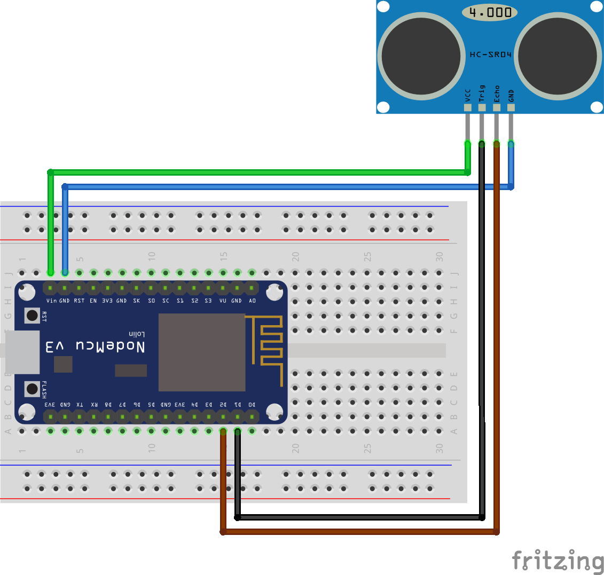

# ESP8266_Ultrasonic
Ultrasonic Sensor with ESP8266 NodeMCU and MQTT

This setup shows how to set up ESP8266 with Ultrasonic Sensor HC-SR04 and MQTT, for example for monitoring the water level of a cistern.

Neccessary components:
- ESP8266 NoceMCU (E-12)
- Ultrasonic Sensor, in my case HC-SR04
- 4-cored cable (1,2mm^2 diameter) in the desired length (in my case it works with > 15 meters) from cistern to the basement
- 8 male Dupont connectors, 4 on both ends of the cable (1)
- breadboard (1)
- some short cables (1) for putting up connections on the breadboard (1)
- case for Ultrasonic Sensor - there are many different forms available for 3D printing on the internet, just search for it

## PinOut diagram:


## Arduino code:
[Get ino file here](Ultrasonic_with_MQTT.ino)
```
#include <ESP8266WiFi.h>
#include <PubSubClient.h>
#include <Ultrasonic.h>

Ultrasonic ultrasonic(12, 13);

#define wifi_ssid         "<wifi ssid>"
#define wifi_password     "<wifi pass>"

#define mqtt_server       "<mqtt host>"
#define mqtt_clientid     "<unique client ID for accessing mqtt server>"

#define abstand_topic     "<topic for distance between sensor and water surface (cm)>"
#define wasserstand_topic "<topic for water level (bottom to water surface (cm))>"
#define fuellstand_topic  "<topic for percentage of water level>" 
#define inhalt_topic      "<topic for content in liters>"

int distanz_leer = 142;  // Distance between sensor and bottom of cistern in cm
float wasser_max = 132;  // Max. Water level (Distance between bottom of cistern and siphon) in cm
int gesamtinhalt = 5000; // Max. content of water in liter

WiFiClient espClient;
PubSubClient client(espClient);

void setup() 
{
    Serial.begin(115200);
    setup_wifi();
    client.setServer(mqtt_server, 1883);
}

void setup_wifi() 
{
    delay(10);
    // We start by connecting to a WiFi network
    Serial.println();
    Serial.print("Connecting to ");
    Serial.println(wifi_ssid);
    WiFi.mode(WIFI_STA);
    WiFi.begin(wifi_ssid, wifi_password);

    while (WiFi.status() != WL_CONNECTED) 
    {
        delay(500);
        Serial.print(".");
    }

    Serial.println("");
    Serial.println("WiFi connected");
    Serial.println("IP address: ");
    Serial.println(WiFi.localIP());
 }

void reconnect()  
{
    // Loop until we're reconnected
    while (!client.connected()) 
    {
        Serial.print("Attempting MQTT connection...");
        // Attempt to connect
        // If you do not want to use a username and password, change next line to
        if (client.connect(mqtt_clientid)) 
        //if (client.connect(mqtt_clientid, mqtt_user, mqtt_password)) {
        {
            Serial.println("connected");
        } 
        else 
        {
            Serial.print("failed, rc=");
            Serial.print(client.state());
            Serial.println(" try again in 5 seconds");
            // Wait 5 seconds before retrying
            delay(5000);
        }
    }
}

void loop() 
{
    if (!client.connected()) 
    {
        reconnect();
    }
    client.loop();
    int Abstand = ultrasonic.distanceRead();
    int Wasserstand = distanz_leer - Abstand;
    int fuellstand = (Wasserstand/wasser_max) * 100;
    int inhalt = (gesamtinhalt/100)*fuellstand;
    // Enable following lines to get debug output //
    /*
      Serial.println("Abstand cm: ");
      Serial.println(Abstand);
      Serial.println("Wasserstand cm: ");
      Serial.println(Wasserstand);
      Serial.println("Füllstand in Prozent: ");
      Serial.println(fuellstand);
      Serial.println("Inhalt in Liter: ");
      Serial.println(inhalt);
    */
    client.publish(abstand_topic, String(Abstand).c_str(), true);
    client.publish(wasserstand_topic, String(Wasserstand).c_str(), true);
    client.publish(fuellstand_topic, String(fuellstand).c_str(), true);
    client.publish(inhalt_topic, String(inhalt).c_str(), true);
    delay(60000); // Check every 60.000 ms = 60 s = 1 min
    //delay(10000); // Check every 10.000 ms = 10 s // For testing purposes it can be useful to have shorter intervals
}
```

## Pictures:
