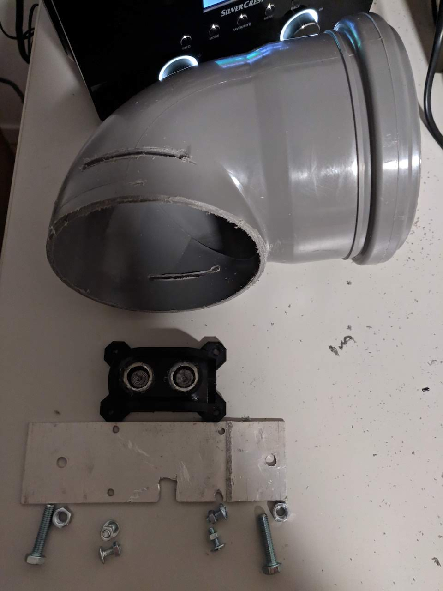

# ESP8266_Ultrasonic
Ultrasonic Sensor with ESP8266 NodeMCU and MQTT

This setup shows how to set up ESP8266 with Ultrasonic Sensor HC-SR04 and MQTT, for example for monitoring the water level of a cistern.
The sensor sends the measured distance from the water surface to the NodeMCU ESP8266. From this value the water level and an estimated percentage of the filling level are calculated and send to an MQTT Broker (in my case, Mosquitto running on a Raspberry Pi).
In OpenHAB items are defined for these values, and send to an InfluxDB, from where you can use the measurements to display them in a Grafana dashboard.

Neccessary components:
- ESP8266 NoceMCU (E-12)
- Ultrasonic Sensor, in my case HC-SR04
- 4-cored cable (1,2mm^2 diameter) in the desired length (in my case it works with > 15 meters) from cistern to the basement
- 8 male Dupont connectors, 4 on both ends of the cable (1)
- breadboard (1)
- some short cables (1) for putting up connections on the breadboard (1)
- case for Ultrasonic Sensor - there are many different forms available for 3D printing on the internet, just search for it

## PinOut diagram:

## Arduino code:
[Get ino file here](Ultrasonic_with_MQTT.ino)

## Pictures:
### holding components ready to be fixed in cistern:

## Setup in OpenHAB
(todo)

## Inclusion in Grafana Dashboard
(todo)
